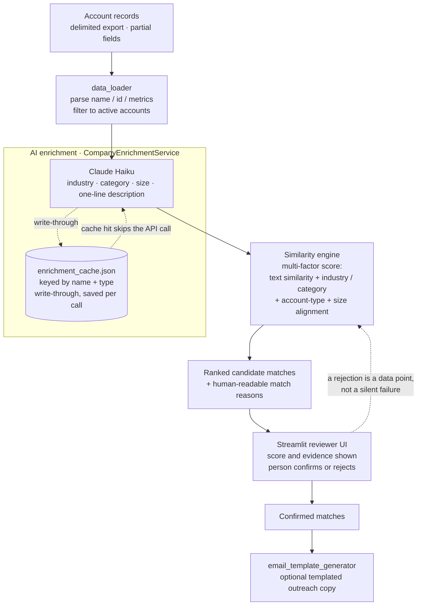

# AI Account Matcher

A design case study for an AI-assisted account matching tool. Given a prospective company, it finds the closest matches in an existing book of accounts, using AI to make sparse, inconsistent records comparable, and puts a human in front of every decision.

> Generalized overview of a tool I designed and built. It names no employer, client, or data. Happy to talk through the approach.

## The problem

Account records arrive with no shared key and lots of gaps: a name, an ID, a few metrics, and little else. "Is this new company like any account we already have?" is a question a person can answer slowly and inconsistently, and the useful context (what industry is this, how big are they, what do they actually sell) is exactly the part that is missing from the raw row.

## Architecture

## How it works

1. **Load and normalize.** Raw account rows are parsed into a typed `Account` model (name, id, type, and numeric metrics), and obviously-inactive rows are filtered out before any AI spend.
2. **Enrich with AI, once.** `CompanyEnrichmentService` calls Claude Haiku to classify each company into an industry, category, rough size, and a one-line description. This is the step that turns a bare name into something comparable. Every result is cached to `enrichment_cache.json` keyed by name and type, written through after each call, so a second run over the same book costs nothing and stays deterministic.
3. **Score on multiple factors.** The similarity engine does not trust any single signal. It blends a text-similarity score with the structured signals the enrichment produced (industry match, category match, account-type alignment, company-size alignment) into one ranked list of candidates.
4. **Explain, then let a human decide.** Each candidate carries human-readable match reasons, and the ranked list is presented in a Streamlit reviewer UI (including a password-gated variant for shared use). A person confirms or rejects. The tool proposes; it never auto-commits a match.
5. **Optional output.** Confirmed matches can feed a templated outreach generator.

## Design decisions worth calling out

- **AI where it removes ambiguity, not everywhere.** The expensive model call is spent on one thing: enrichment that makes two sparse rows comparable. Matching itself is deterministic scoring over the enriched fields, so the ranking is inspectable and repeatable rather than a black box.
- **Cache-first, write-through.** Enrichment is cached on disk and saved after every single call, not at the end of a batch. A crash halfway through a large run loses nothing, and re-running is idempotent and free for already-seen accounts. Cost and latency both collapse on repeat use.
- **Multi-factor scoring beats one clever signal.** Names lie (abbreviations, punctuation, suffixes), so the score deliberately combines text similarity with enrichment-derived industry, category, type, and size. No single field can carry a match on its own.
- **Human-in-the-loop is the product, not a fallback.** A wrong merge quietly corrupts everything downstream, so the design surfaces scores and reasons and requires a person to confirm. Rejections are visible signal for tuning, not silent dead ends.
- **Honest about the embedding.** The similarity step uses a lightweight text-feature vector today; a production build would swap in a dedicated embedding model behind the same interface. The seam is deliberately isolated in one method so that upgrade is a drop-in, not a rewrite.

## Stack

Python. Anthropic Claude (Haiku) for enrichment. A custom multi-factor similarity and scoring engine. A Streamlit reviewer UI (with a password-gated variant). On-disk JSON enrichment cache. Optional templated outreach generation. API keys are read from the environment, never hardcoded.

## Status

Generalized design overview. The working tool was built for a specific context that this write-up deliberately omits. Happy to walk through the scoring model, the caching strategy, or the review workflow in detail.
